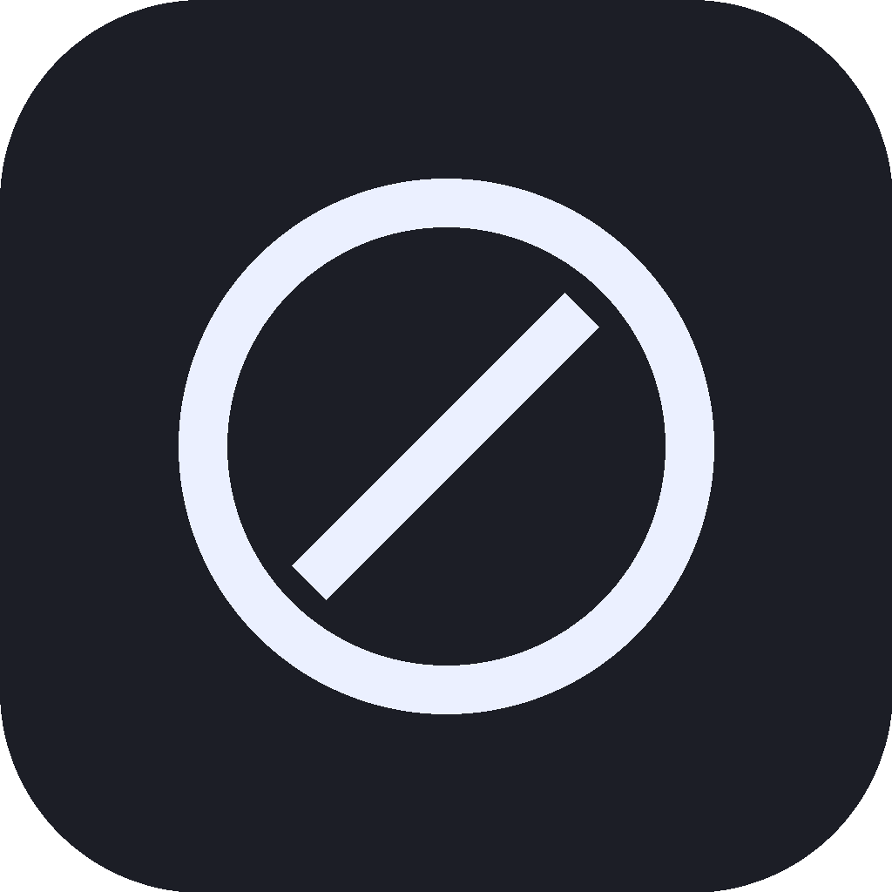

# WorkBuddy 更新屏蔽器 / WorkBuddy Update Blocker

> 一款 macOS 原生的 WorkBuddy 强制更新屏蔽工具：通过 `/etc/hosts` 屏蔽更新下载域名 + 锁定缓存目录权限，彻底阻断 WorkBuddy（腾讯 Electron 版）的强制自动更新。/ A native macOS tool that blocks WorkBuddy's (Tencent Electron) forced auto-update by blocking the update download domain in `/etc/hosts` and locking the cache directory permissions.

> **作者 Author：banqiu**
> **许可证 License：MIT**（详见 LICENSE）。可自由使用、修改与再分发，须保留版权与许可声明。

<p align="center"></p>

[下载最新版 / Download](https://github.com/hwl513782273/WorkBuddyUpdateBlocker/releases/latest) · [问题反馈 / Issues](https://github.com/hwl513782273/WorkBuddyUpdateBlocker/issues)

---

## 中文

### 主要功能
- **两种阻断模式，任选其一或组合**：
  - **更改域名模式**：在 `/etc/hosts` 中将更新包下载域名 `download.codebuddy.cn` 解析到 `0.0.0.0`，从源头阻断更新包下载；不影响 AI / 核心功能。
  - **禁止下载模式**：将 WorkBuddy 的下载缓存目录 `downloads/` 与解压暂存目录 `extracted/` 权限设为 `000`，使 WorkBuddy 无法写入更新包或解压暂存，下载与解压安装被双重阻断。
- 一键**启用屏蔽 / 禁用屏蔽**（系统密码框授权，需管理员权限写 `/etc/hosts`）。
- **重启 WorkBuddy** 按钮：屏蔽后立即重启让配置生效。
- **检查更新下载目录**：在 Finder 打开 WorkBuddy 自动下载更新包落地的本地目录，并列出其中三类内容（downloads / extracted / backups）。
- **自动备份更新包**：将下载目录里新的 `.zip` 更新包备份到用户指定文件夹；与「禁止下载模式」互斥（启用禁止下载则自动关闭备份）。
- 原生 SwiftUI 单文件 App，拖入「应用程序」即用，**无依赖脚本、无常驻后台进程**。

### 快速开始
1. 在 Releases 下载对应系统的 DMG（见下方「macOS 版本选择」）。
2. 打开 DMG，把 `WorkBuddy更新屏蔽器.app` 拖入「应用程序」。
3. 首次打开：右键 → 打开（或终端执行 `xattr -dr com.apple.quarantine "/Applications/WorkBuddy更新屏蔽器.app"`）。
4. 选择一种模式，点击「启用屏蔽」并输入管理员密码；若要还原，点击「禁用屏蔽」。

从源码构建（需 macOS 11+ 与 Swift 工具链）：
```bash
swiftc -O -parse-as-library -framework SwiftUI -framework AppKit -framework Cocoa -framework Combine \
  main.swift -o "WorkBuddy更新屏蔽器.app/Contents/MacOS/WorkBuddy更新屏蔽器"
codesign --force --deep --sign - "WorkBuddy更新屏蔽器.app"
```

### macOS 版本选择
- **Apple Silicon（M1 及更新）**：下载 `11.0-WorkBuddyUpdateBlocker-1.9-arm64.dmg`（纯 arm64，macOS 11.0+）。
- **Intel（x86_64）**：下载 `12.0-WorkBuddyUpdateBlocker-1.9-x86_64.dmg`（macOS 12.0+，已在 Intel 真机实测通过）。

> 发行版 DMG 为 ad-hoc 签名、**未公证（notarized）**，首次打开请右键「打开」放行 Gatekeeper。命名格式为：`支持最低版本-软件名-版本-架构`（如 `11.0-WorkBuddyUpdateBlocker-1.9-arm64.dmg`）。

### 工作原理
- **更改域名模式（网络层）**：更新包实际下载自 `download.codebuddy.cn`（更新日志已证实）。将其解析到 `0.0.0.0` 后，WorkBuddy 拉取更新时连接失败，更新被阻断；而 AI / 账户后端走 `copilot.tencent.com`，**不屏蔽**，核心功能不受影响。
- **禁止下载模式（文件系统层）**：锁定 `~/Library/Caches/com.workbuddy.workbuddy.BundleMigration/` 下的 `downloads/`（下载缓存）与 `extracted/`（解压暂存）为 `000`，WorkBuddy 无法写入更新包或读取解压后的待装程序，下载与解压覆盖安装阶段被双重阻断。
- **为什么不用内置开关**：WorkBuddy 内置 `DISABLE_AUTOUPDATER` 环境变量，但在当前 macOS 上 `launchctl setenv` 受权限限制，无法注入到 GUI 会话进程，故改用上述两层方案。

### 差异化亮点
- 🛡 **双保险阻断**：网络层（hosts 域名屏蔽）+ 文件系统层（目录权限锁）任选或叠加，比单纯改配置更彻底。
- 🧰 **图形化一键操作**：启用 / 禁用屏蔽、检查下载目录、重启 WorkBuddy，全部按钮完成，告别命令行。
- 🔄 **自动备份更新包**：下载目录里出现新 `.zip` 自动备份到指定文件夹，重复包移入废纸篓（可恢复），不误删。
- 🔒 **全本地、零上传**：所有操作在你的 Mac 上完成，不依赖云端、不联网也能跑。
- 📦 **原生单文件 App，零依赖**：拖入「应用程序」即用，没有 install 脚本、没有常驻后台进程、不污染系统。
- 🪟 **过程透明可审计**：写 `/etc/hosts` 与 `chmod` 均弹系统密码框授权，所执行操作在界面日志中透明可见。

### 已知限制
- **副作用**：技能市场、头像等走同一 CDN（`download.codebuddy.cn`）的资源可能无法加载，属非核心功能；如需要，临时「禁用屏蔽」即可恢复。
- 发行版未公证（notarized），首次打开请右键「打开」放行 Gatekeeper；在 Apple Silicon 上请勿用 Intel 版以免 Rosetta 兼容问题。
- 本工具仅阻断 WorkBuddy 的更新下载与解压安装；若腾讯改版更新机制（更换域名 / 路径），需相应更新屏蔽规则。

---

## English

### Highlights
- **Two blocking modes, use either or both**:
  - **Change-domain mode**: blocks the update download domain `download.codebuddy.cn` by resolving it to `0.0.0.0` in `/etc/hosts`, cutting off the update download at the source without affecting AI / core features.
  - **Block-download mode**: sets the download cache directory `downloads/` and extracted temp directory `extracted/` permissions to `000`, so WorkBuddy cannot write the update package or read the extracted app — blocking both download and extraction/install.
- One-click **Enable / Disable blocking** (system password prompt, requires admin to write `/etc/hosts`).
- **Restart WorkBuddy** button to apply changes immediately.
- **Inspect download directory**: opens the local folder where WorkBuddy drops updates in Finder and lists its three categories (downloads / extracted / backups).
- **Auto-backup updates**: backs up new `.zip` packages to a user-chosen folder; mutually exclusive with Block-download mode.
- Native SwiftUI single-file app — drag into Applications and it just works, **no helper scripts, no background daemons**.

### Quick start
1. Download the DMG for your system from Releases (see "Choose a macOS build" below).
2. Open the DMG and drag `WorkBuddy更新屏蔽器.app` into Applications.
3. First launch: right-click → Open (or run `xattr -dr com.apple.quarantine "/Applications/WorkBuddy更新屏蔽器.app"` in Terminal).
4. Pick a mode, click "启用屏蔽 / Enable" and enter your admin password; to revert, click "禁用屏蔽 / Disable".

Build from source (requires macOS 11+ and the Swift toolchain):
```bash
swiftc -O -parse-as-library -framework SwiftUI -framework AppKit -framework Cocoa -framework Combine \
  main.swift -o "WorkBuddy更新屏蔽器.app/Contents/MacOS/WorkBuddy更新屏蔽器"
codesign --force --deep --sign - "WorkBuddy更新屏蔽器.app"
```

### Choose a macOS build
- **Apple Silicon (M1 or newer)**: use `11.0-WorkBuddyUpdateBlocker-1.9-arm64.dmg` (arm64 only, macOS 11.0+).
- **Intel (x86_64)**: use `12.0-WorkBuddyUpdateBlocker-1.9-x86_64.dmg` (macOS 12.0+; tested and verified on a real Intel Mac).

> Release DMGs are ad-hoc signed and **not notarized**; right-click "Open" on first launch to bypass Gatekeeper. Release asset naming: `min-version-appname-version-arch` (e.g. `11.0-WorkBuddyUpdateBlocker-1.9-arm64.dmg`).

### How it works
- **Change-domain mode (network layer)**: the update package is actually downloaded from `download.codebuddy.cn` (confirmed via update logs). Resolving it to `0.0.0.0` makes WorkBuddy fail to fetch updates; the AI / account backend on `copilot.tencent.com` is **not** blocked, so core features keep working.
- **Block-download mode (filesystem layer)**: locks `downloads/` (download cache) and `extracted/` (extraction temp) under `~/Library/Caches/com.workbuddy.workbuddy.BundleMigration/` to `000`, so WorkBuddy cannot write the update package or read the extracted app.
- **Why not the built-in switch**: WorkBuddy has a `DISABLE_AUTOUPDATER` env var, but on current macOS `launchctl setenv` is privilege-restricted and cannot inject into the GUI session process, so the two layers above are used instead.

### Why this tool
- 🛡 **Double protection**: network-layer (hosts domain block) + filesystem-layer (directory permission lock), either alone or combined — more thorough than config edits.
- 🧰 **GUI one-click ops**: enable / disable blocking, inspect the download dir, restart WorkBuddy — all buttons, no terminal needed.
- 🔄 **Auto-backup updates**: new `.zip` in the download dir is auto-backed-up; duplicates go to Trash (recoverable), never hard-deleted.
- 🔒 **Fully local, zero upload**: everything runs on your Mac — no cloud dependency.
- 📦 **Native single-file app, zero dependencies**: drag into Applications and it just works; no install scripts, no background daemons.
- 🪟 **Transparent, auditable**: writing `/etc/hosts` and `chmod` both prompt for the admin password; operations are shown transparently in the UI log.

### Known limitations
- **Side effect**: resources served from the same CDN (`download.codebuddy.cn`) such as the skill marketplace and avatars may fail to load — non-core features; temporarily "Disable" to restore.
- Release builds are not notarized; right-click "Open" on first launch to bypass Gatekeeper.
- This tool only blocks WorkBuddy's update download and extraction/install; if Tencent changes the update mechanism (domain / path), the block rules need updating accordingly.

---

## 隐私与安全 / Privacy and security
- 纯本地运行，不上传任何数据；所有屏蔽与备份操作均在你的 Mac 上完成。
- 写 `/etc/hosts` 与 `chmod` 目录权限需管理员密码（`osascript with administrator privileges`），所执行操作在界面日志中透明可见。
- 应用未公证（notarized），请仅从你信任的来源（本仓库 Releases）获取，并在首次打开时右键放行。

---

## 许可证 / License
**MIT License** — 版权归 **banqiu** 所有（2026）。
- 允许个人与商业免费使用、修改、再分发，须保留版权与许可声明。
- 完整条款见 [LICENSE](LICENSE)。

---

## 支持 / Support
WorkBuddy 更新屏蔽器是一款免费开源工具，基于 MIT 许可发布。如果你觉得好用，欢迎在 GitHub 上点个 Star，或反馈问题 / 提交 PR 帮它变得更好 —— 纯自愿。 This tool is free, open-source, and released under the MIT License. If it helps you, a GitHub Star or an issue/PR is warmly welcome — entirely optional.
